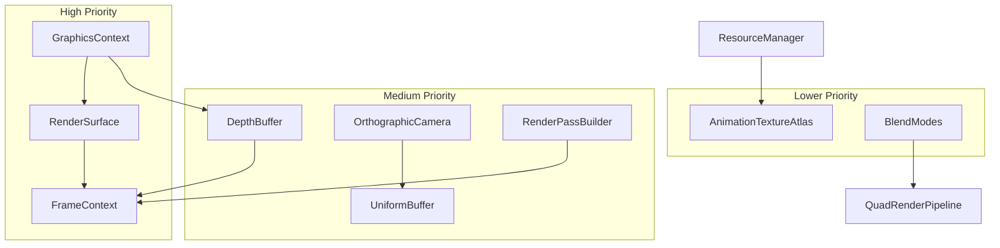

# Main.cpp Refactoring Analysis

## Overview

After analyzing [`main.cpp`](../Renderer/main.cpp), I've identified several distinct behaviors that are currently embedded in the main function. These can be refactored into dedicated classes to improve code organization, testability, and maintainability.

---

## Identified Behaviors for Refactoring

### 1. **WebGPU Instance & Device Initialization** (Lines 51-123)

**Current Location:** Lines 51-123 in [`main.cpp`](../Renderer/main.cpp:51)

**Behavior Description:**

- Creates WebGPU instance
- Requests adapter with surface compatibility
- Enumerates and logs adapter features
- Configures device limits
- Creates device with required limits
- Sets up error callback

**Proposed Refactoring:**

Extend the existing [`Renderer`](../Renderer/Renderer.h:33) class or create a new `GraphicsContext` class:

```cpp
class GraphicsContext {
public:
    GraphicsContext(Window& window);
    ~GraphicsContext();

    wgpu::Device GetDevice() const;
    wgpu::Queue GetQueue() const;
    wgpu::Adapter GetAdapter() const;
    wgpu::Instance GetInstance() const;
    wgpu::Surface GetSurface() const;

    uint32_t GetUniformAlignment() const;

private:
    void InitializeInstance();
    void RequestAdapter(wgpu::Surface surface);
    void ConfigureDeviceLimits();
    void CreateDevice();
    void SetupErrorHandling();

    wgpu::Instance _instance;
    wgpu::Adapter _adapter;
    wgpu::Device _device;
    wgpu::Queue _queue;
    wgpu::Surface _surface;
    wgpu::SupportedLimits _deviceLimits;
};
```

---

### 2. **Surface/Swapchain Configuration** (Lines 165-180)

**Current Location:** Lines 165-180 in [`main.cpp`](../Renderer/main.cpp:165)

**Behavior Description:**

- Gets preferred texture format
- Configures surface dimensions, format, usage, and present mode

**Proposed Refactoring:**

Create a `SwapChain` or `RenderSurface` class:

```cpp
class RenderSurface {
public:
    RenderSurface(wgpu::Surface surface, wgpu::Adapter adapter,
                  wgpu::Device device, uint32_t width, uint32_t height);
    ~RenderSurface();

    void Resize(uint32_t width, uint32_t height);
    wgpu::TextureFormat GetFormat() const;
    wgpu::SurfaceTexture GetCurrentTexture();
    void Present();

private:
    void Configure();

    wgpu::Surface _surface;
    wgpu::Device _device;
    wgpu::SurfaceConfiguration _config;
};
```

---

### 3. **Camera/View Management** (Lines 182-188)

**Current Location:** Lines 182-188 in [`main.cpp`](../Renderer/main.cpp:182)

**Behavior Description:**

- Manages 2D orthographic camera position and extents
- Provides camera uniforms for quad/sprite rendering

**Proposed Refactoring:**

Create a simple `OrthographicCamera` class (no inheritance needed):

```cpp
class OrthographicCamera {
public:
    OrthographicCamera(Vec2f position, Vec2f extents);

    void SetPosition(Vec2f position);
    void SetExtents(Vec2f extents);
    void SetExtents(uint32_t width, uint32_t height);

    Vec2f GetPosition() const;
    Vec2f GetExtents() const;

    // Returns the uniform data ready for GPU upload
    CamUniforms GetUniforms() const;

    // Convenience method to update buffer directly
    void UpdateBuffer(Gfx::Buffer& buffer, wgpu::Queue& queue) const;

private:
    Vec2f _position;
    Vec2f _extents;
};
```

**Usage Example:**

```cpp
// In main.cpp, replace:
CamUniforms quadCam;
quadCam.position = Vec2f{ 0.5f, 0.5f };
quadCam.extents = Vec2f{ (float)k_screenWidth, (float)k_screenHeight };
camBuffer.EnqueueCopy(&quadCam, 0, queue);

// With:
OrthographicCamera camera({0.5f, 0.5f}, {(float)k_screenWidth, (float)k_screenHeight});
camera.UpdateBuffer(camBuffer, queue);
```

---

### 4. **Uniform Buffer Management** (Lines 150-163, 374-381)

**Current Location:** Lines 150-163 and 374-381 in [`main.cpp`](../Renderer/main.cpp:150)

**Behavior Description:**

- Defines uniform structure
- Creates uniform buffer with proper alignment
- Updates uniforms each frame

**Proposed Refactoring:**

Create a templated `UniformBuffer` class:

```cpp
template<typename T>
class UniformBuffer {
public:
    UniformBuffer(wgpu::Device device, uint32_t alignment = 0);

    void Update(T const& data, wgpu::Queue& queue);
    void Update(T const& data, uint32_t offset, wgpu::Queue& queue);

    Gfx::Buffer const& GetBuffer() const;

private:
    Gfx::Buffer _buffer;
    uint32_t _stride;
};
```

---

### 5. **Depth Buffer/Attachment Management** (Lines 214-222, 271-283)

**Current Location:** Lines 214-222 and 271-283 in [`main.cpp`](../Renderer/main.cpp:214)

**Behavior Description:**

- Creates depth stencil state
- Creates depth texture
- Creates depth texture view

**Proposed Refactoring:**

Create a `DepthBuffer` class:

```cpp
class DepthBuffer {
public:
    DepthBuffer(wgpu::Device device, uint32_t width, uint32_t height,
                wgpu::TextureFormat format = wgpu::TextureFormat::Depth24Plus);
    ~DepthBuffer();

    void Resize(wgpu::Device device, uint32_t width, uint32_t height);

    wgpu::TextureView GetView() const;
    wgpu::DepthStencilState GetDepthStencilState() const;
    wgpu::RenderPassDepthStencilAttachment GetAttachment(float clearValue = 1.0f) const;

private:
    Gfx::Texture _texture;
    wgpu::TextureView _view;
    wgpu::TextureFormat _format;
};
```

---

### 6. **Blend State Configuration** (Lines 192-203)

**Current Location:** Lines 192-203 in [`main.cpp`](../Renderer/main.cpp:192)

**Behavior Description:**

- Configures blend state for alpha blending
- Creates color target state

**Proposed Refactoring:**

Create a `BlendMode` utility or extend pipeline configuration:

```cpp
namespace BlendModes {
    wgpu::BlendState AlphaBlend();
    wgpu::BlendState Additive();
    wgpu::BlendState Opaque();
    wgpu::BlendState Multiply();
}

struct ColorTargetConfig {
    wgpu::TextureFormat format;
    wgpu::BlendState blendState;
    wgpu::ColorWriteMask writeMask = wgpu::ColorWriteMask::All;

    wgpu::ColorTargetState ToState() const;
};
```

---

### 7. **Render Pass Management** (Lines 387-418)

**Current Location:** Lines 387-418 in [`main.cpp`](../Renderer/main.cpp:387)

**Behavior Description:**

- Creates render pass color attachment
- Creates render pass depth attachment
- Configures render pass descriptor
- Begins and ends render pass

**Proposed Refactoring:**

Create a `RenderPass` builder or class:

```cpp
class RenderPassBuilder {
public:
    RenderPassBuilder& SetColorAttachment(wgpu::TextureView view,
                                          wgpu::Color clearColor = {0, 0, 0, 1});
    RenderPassBuilder& SetDepthAttachment(wgpu::TextureView view,
                                          float clearDepth = 1.0f);
    RenderPassBuilder& SetStencilAttachment(wgpu::TextureView view,
                                            uint32_t clearValue = 0);

    wgpu::RenderPassEncoder Begin(wgpu::CommandEncoder encoder);

private:
    wgpu::RenderPassColorAttachment _colorAttachment;
    wgpu::RenderPassDepthStencilAttachment _depthAttachment;
    bool _hasDepth = false;
};
```

---

### 8. **Animation Texture Management** (Lines 223-255)

**Current Location:** Lines 223-255 in [`main.cpp`](../Renderer/main.cpp:223)

**Behavior Description:**

- Loads animations from ResourceManager
- Creates texture array for animations
- Copies animation data to texture layers

**Proposed Refactoring:**

Extend [`ResourceManager`](../Renderer/ResourceManager.h:9) or create `AnimationTextureAtlas`:

```cpp
class AnimationTextureAtlas {
public:
    AnimationTextureAtlas(wgpu::Device device, uint32_t maxLayers = 16);

    uint32_t AddAnimation(TextureResource const& animation, wgpu::Queue& queue);
    void Upload(wgpu::Queue& queue);

    Gfx::Texture const& GetTexture() const;
    uint32_t GetLayerForAnimation(std::string const& name) const;

private:
    Gfx::Texture _texture;
    std::unordered_map<std::string, uint32_t> _animationLayers;
    uint32_t _nextLayer = 0;
};
```

---

### 9. **Frame Timing/Clock** (Lines 340-341)

**Current Location:** Lines 340-341 in [`main.cpp`](../Renderer/main.cpp:340)

**Behavior Description:**

- Ticks the clock each frame
- Gets delta time

**Note:** This is already partially refactored in [`Chrono.h`](../Renderer/Chrono.h). Consider if additional frame statistics are needed.

**Proposed Enhancement:**

```cpp
class FrameTimer {
public:
    void BeginFrame();
    void EndFrame();

    float GetDeltaTime() const;
    float GetTotalTime() const;
    float GetFPS() const;
    float GetAverageFPS(uint32_t sampleCount = 60) const;

private:
    // ... timing data
};
```

---

### 10. **Command Buffer Submission** (Lines 421-437)

**Current Location:** Lines 421-437 in [`main.cpp`](../Renderer/main.cpp:421)

**Behavior Description:**

- Finishes command encoder
- Submits command buffer
- Releases resources
- Presents surface
- Handles backend-specific device tick

**Proposed Refactoring:**

Create a `FrameContext` or `CommandSubmitter`:

```cpp
class FrameContext {
public:
    FrameContext(wgpu::Device device, wgpu::Queue queue, RenderSurface& surface);
    ~FrameContext(); // Auto-submits and presents

    wgpu::CommandEncoder GetEncoder();
    wgpu::TextureView GetBackBuffer();

    void Submit();

private:
    wgpu::Device _device;
    wgpu::Queue _queue;
    RenderSurface& _surface;
    wgpu::CommandEncoder _encoder;
    wgpu::TextureView _backBuffer;
    bool _submitted = false;
};
```

---

### 11. **Resource Cleanup/RAII** (Lines 440-446)

**Current Location:** Lines 440-446 in [`main.cpp`](../Renderer/main.cpp:440)

**Behavior Description:**

- Manual release of WebGPU resources

**Proposed Refactoring:**

The existing classes already use RAII. Consider creating smart pointer wrappers for WebGPU types:

```cpp
template<typename T>
class WGPUHandle {
public:
    WGPUHandle(T handle = nullptr);
    ~WGPUHandle();

    WGPUHandle(WGPUHandle&& other);
    WGPUHandle& operator=(WGPUHandle&& other);

    T Get() const;
    T Release();
    void Reset(T handle = nullptr);

private:
    T _handle;
};

// Specializations for each WebGPU type
using DeviceHandle = WGPUHandle<wgpu::Device>;
using QueueHandle = WGPUHandle<wgpu::Queue>;
// etc.
```

---

## Refactoring Priority Diagram



---

## Summary Table

| #   | Behavior           | Lines            | Proposed Class          | Priority |
| --- | ------------------ | ---------------- | ----------------------- | -------- |
| 1   | WebGPU Init        | 51-123           | `GraphicsContext`       | High     |
| 2   | Surface Config     | 165-180          | `RenderSurface`         | High     |
| 3   | Camera/View        | 182-188          | `OrthographicCamera`    | Medium   |
| 4   | Uniform Buffers    | 150-163, 374-381 | `UniformBuffer<T>`      | Medium   |
| 5   | Depth Buffer       | 214-222, 271-283 | `DepthBuffer`           | Medium   |
| 6   | Blend States       | 192-203          | `BlendModes` namespace  | Low      |
| 7   | Render Pass        | 387-418          | `RenderPassBuilder`     | Medium   |
| 8   | Animation Textures | 223-255          | `AnimationTextureAtlas` | Low      |
| 9   | Frame Timing       | 340-341          | Enhance `Chrono`        | Low      |
| 10  | Command Submission | 421-437          | `FrameContext`          | High     |
| 11  | Resource Cleanup   | 440-446          | `WGPUHandle<T>`         | Low      |

---

## Recommended Implementation Order

1. **Phase 1 - Core Infrastructure**

   - `GraphicsContext` - Centralizes all WebGPU initialization
   - `RenderSurface` - Manages swapchain/surface
   - `FrameContext` - Simplifies per-frame rendering

2. **Phase 2 - Rendering Utilities**

   - `DepthBuffer` - Encapsulates depth texture management
   - `RenderPassBuilder` - Simplifies render pass creation
   - `OrthographicCamera` - Encapsulates 2D camera logic

3. **Phase 3 - Data Management**

   - `UniformBuffer<T>` - Type-safe uniform handling
   - `AnimationTextureAtlas` - Extends ResourceManager

4. **Phase 4 - Polish**
   - `BlendModes` - Utility namespace
   - `WGPUHandle<T>` - RAII wrappers
   - Frame timing enhancements
